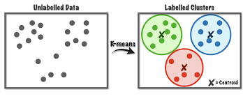

#  Clustering

## Indledning og læringsmål

### Læringsmål

:::goals
Du skal være i stand til at: 

* forklare den grundlæggende idé bag __k-means__-klyngeanalyse (k-means clustering)
* bruge funktionen `kmeans()` og præsentere resultaterne i et tidy format med `broom::augment()`
* anvende `purrr::map()` til at afprøve flere k-værdier og argumentere for det antal, der passer bedst til datasættet
* udføre en enkel hierarkisk klyngeanalyse med `hclust()` og fortolke dendrogrammet 
:::


:::checklist
* Se alle tre videoer om k-means samt notatet om hierarkisk clustering
* Læs kapitelteksten (denne fil)
* Gennemfør quizzen "Clustering"
* Lav problemstillingerne
:::

### Indledning til kapitel


Clustering har til formål at dele observationer op i klynger (clusters), så observationer inden for samme klynge ligner hinanden mest muligt, mens observationer i forskellige klynger adskiller sig mest muligt. Det hjælper os med at afklare spørgsmål som:

* Hvor mange forskellige klynger findes der i datasættet?
* Hvilke observationer tilhører de enkelte klynger?
* Afslører mønstre feks. subtyper, segmenter eller udliggere

I kapitlet demonstrerer vi to populære metoder, k-means og hierarkisk clustering, begge implementeret i en __tidyverse__-workflow.

### Video ressourcer

* Video 1: K-means clustering 

```{r,echo=FALSE}
library("vembedr")
#Link her hvis det ikke virker nedenunder: https://player.vimeo.com/video/553656150

embed_url("https://vimeo.com/553656150")
```

---

* Video 2: augment, glanced og tidy med K-means. __OBS__ der er en lille fejl i koden omkring 6:00 - den anden `geom_point` skal være `geom_point(data = kclust_tidy,aes(x=bill_length,y=bill_depth),shape="x,colour="black")` fordi tallerne er allerede basaserede på "scaled" data i `kclust_tidy` - se sektion \@ref(plotcentroids) for uddybelse.

```{r,echo=FALSE}
#Link her hvis det ikke virker nedenunder: https://player.vimeo.com/video/553656139

#library("vembedr")

embed_url("https://vimeo.com/553656139")
```

---

* Video 3: Hvor mange clusters skal man vælge?

```{r,echo=FALSE}
#library("vembedr")
#Link her hvis det ikke virker nedenunder: https://player.vimeo.com/video/553656129


embed_url("https://vimeo.com/553656129")
```

---

* "Video" 4: Hierarchical clustering

Se venligst kursusnotaterne

---

## Method 1: K-means clustering

```{r,message=FALSE,comment=FALSE,warning=FALSE}
library(palmerpenguins)
library(tidyverse)
library(broom)
```

I k-means clustering bliver samtlige observationer tilknyttet den nærmeste cluster "centroid" (se "hvordan fungerer kmeans?" nedenunder). I k-means skal man specificere antallet af clusters, som observationerne skal opdeles i, på forhånd. Derfor kræver det en vis undersøgelsesindsats at vælge det bedste antal clusters, der passer til problemstillingen, eller som bedst repræsenterer datasættet.

Lad os tage udgangspunkt i datasættet `penguins`. Vi begynder med at fjerne observationerne med `NA` i mindst én variabel ved at bruge funktionen `drop_na`, og ved at specificere at `year` skal være en faktor (for at skelne den fra de andre numeriske kolonner):

```{r}
data(penguins)
penguins <- penguins %>% 
  mutate(year=as.factor(year)) %>%
  drop_na() 
```

Vi ved allerede i forvejen, at der er 3 `species` i disse data, som vi plotter her med forskellige farver.

```{r,fig.width=5,fig.height=4}
penguins %>% ggplot(aes(x=bill_length_mm,y=body_mass_g,colour=species)) + 
  geom_point() + 
  theme_classic()
```

Vi vil gerne bruge k-means clustering på de numeriske variabler i datasættet og beregne 3 clusters ud fra disse. Derefter kan det være interessant at sammenligne de clusters, vi får, med de tre arter af pingviner - hvor gode er disse clusters til at skelne mellem de forskellige arter, eller indfanger de en anden struktur i datasættet (for eksempel køn eller den ø, de bor på)?


### Hvordan fungerer kmeans?

K-means er en iterativ proces. Lad os forestille os, at vi gerne vil have tre clusters i vores data. Man starter med tre tilfældige observationer og kalder dem for clusterens middelværdier eller "centroids". Man tilknytter alle observationer til én af de tre clusters (den nærmeste af de tre centroids), og beregner herefter en ny middelværdi/centroid for hver cluster. Man tilknytter samtlige observationer igen efter den nærmeste af de tre nye cluster centroids, og så gentager man processen flere gange. Efter flere gange konvergerer de tre centroids mod nogle faste værdier, der ikke længere ændrer sig meget, hver gang man gentager processen. Disse tre centroids definerer de tre endelige clusters, og samtlige observationer er tilknyttet én af disse.

```{r, echo=FALSE,out.width="50%", fig.cap="source: https://towardsdatascience.com/k-means-a-complete-introduction-1702af9cd8c"}
# Bigger fig.width
library(png)
library(knitr)

```

Jeg beder ikke om detaljerne i metoden, men der er mange videoer på YouTube, der bedre forklarer, hvordan k-means fungerer, for eksempel: https://www.youtube.com/watch?v=4b5d3muPQmA

Bemærk, at der er noget __tilfældighed__ indbygget i algoritmen. Det betyder, at hver gang man anvender k-means, får man et lidt anderledes resultat.

### Within/between sum of squares

Man kan forestille sig, at hvis man laver en god clustering af et datasæt, så ligner observationerne inden for den samme cluster hinanden meget, mens observationerne i forskellige clusters er meget forskellige fra hinanden. Med andre ord, skal afstanden mellem observationerne i samme cluster være så lille som muligt, og afstanden mellem observationerne i forskellige clusters skal være så stor som muligt. For at måle dette kan man beregne følgende:  

* __total within sum of squares__ - den totale kvadrerede afstand fra observationerne til deres nærmeste centroid.
* __total between sum of squares__ - den totale afstand fra centroids til alle andre centroids. Denne skal være så stor som muligt.


### Kør k-means i R

K-means _fungerer kun på numeriske data_, som vi kan vælge fra datasættet med `select()` i kombination med hjælpefunktionen `where(is.numeric)`. Vi bruger også `scale()`, hvilket betyder, at alle variabler får den samme skala, og det forhindrer, at nogle får mere indflydelse end andre i det endelige resultat.

```{r}
penguins_scaled <- penguins %>% 
  select(where(is.numeric)) %>% 
  scale()
```

Man er også nødt til at specificere på forhånd, hvor mange clusters man ønsker at opdele datasættet i, så lad os sige `centers=3` inden for funktionen `kmeans()` her og beregne vores clusters:

```{r}
kclust <- kmeans(penguins_scaled,centers = 3)
kclust
```

Man får forskellige ting frem, for eksempel:

* `Cluster means` - det svarer til de centroids markeret med __x__ i figuren ovenfor - bemærk, at de er 4-dimensionelle, da vi har brugt 4 variabler til at beregne resultatet. 
* `Clustering` vector - hvilken cluster hver observation er blevet tilknyttet.
* `Within cluster sum of squares` - Jo mindre, jo bedre - hvor meget observationerne inden for samme cluster ligner hinanden (den totale kvadrerede afstand fra observationerne til deres nærmeste centroid).

### Ryd op i k-means resultaterne med pakken `broom`

Fra pakken `broom` har vi indtil videre mest beskæftiget os med `glance()`. Med `glance()` får man én-linje baserede summary statistikker fra én eller flere modeller samlet i én dataramme, for at lette et plot/labels osv. Der er også to andre funktioner vi tager i brug her. Her er en beskrivelse af de tre.

Broom verb    | Beskrivelse
----------- | -----------------
`glance()`    | én-linje summary (giver bl.a. tot.withinss, vi kan bruge til elbow plot)
`augment()`   | Tilføj datasæt til clusters - feks. lav plots farvet efter cluster 
`tidy()`      | Multi-linje summary - (centroid koordinater)

For at lave et plot af clusters kan det især være nyttigt at benytte `augment`. Her kan man se, at vi har fået en kolonne, der hedder `.cluster` med i den oprindelige dataramme (jeg flyttede kolonnen til første plads i nedenstående kode, så man kan se den i outputtet af kursusnoterne). 

```{r}
kc1 <- augment(kclust, penguins) #clustering = første plads, data = anden plads
kc1 %>% select(.cluster,all_of(names(penguins)))
```

Nu benytter vi `kc1` til at lave et plot. Her giver jeg en farve efter `.cluster` og form efter `species`, så vi kan sammenligne vores beregnede clusters med de tre forskellige arter. Bemærk her, at jeg kun har to variabler i plottet, men der er faktisk fire variabler, som blev brugt til at lave clusters med funktionen `kmeans`. En anden måde er at plotte de første to principal components i stedet for to af de fire variabler - det beskæftiger vi os med næste gang.

```{r,fig.width=5,fig.height=4}
ggplot(kc1, aes(x = scale(bill_length_mm), 
                y = scale(bill_depth_mm))) + 
  geom_point(aes(color = .cluster, shape = species)) + theme_minimal()
```

Vi kan også f.eks. optælle, hvor mange af de tre arter vi får i hver af vores tre clusters, hvor vi kan se, at `Adelie` og `Chinstrap` er blevet mere blandet mellem to af de tre clusters end `Gentoo`.

```{r}
kc1 %>% count(.cluster, species)
```


### Plot cluster centroids {#plotcentroids}

Næste skridt er at se på resultatet af funktionen `tidy()` fra `broom`-pakken. Her har vi fået en overskuelig dataramme med middelværdierne (centroids) for de tre clusters over de fire variabler, som blev brugt i beregningerne.

```{r}
kclust_tidy <- kclust %>% tidy()
kclust_tidy
```

Herefter benytter jeg `kclust_tidy` som et ekstra datasæt i ovenstående plot, men indenfor en anden `geom_point()` for at tilføje en `x`-form i midten af de tre clusters - se de følgende tre punkter, der forklarer nogle detaljer i koden:

* Jeg bruger funktionen `scale()` på `bill_length_mm` og `bill_depth_mm`, fordi mine centroids, som også skal med i plottet, blev beregnet på skalerede data.
* Jeg behøver ikke at anvende `scale()` på mine centroids lagret i `kclust_tidy`, så jeg angiver bare akser-variablerne i `aes()` uden at anvende `scale()`.
* Jeg har brugt `color` og `shape` som lokale aesthetics i den første `geom_point()` her, da de ikke eksisterer som kolonner i `kclust_tidy`.

```{r,fig.width=5,fig.height=4}
ggplot(kc1, aes(x = scale(bill_length_mm), # skal skalere de oprindelige data
                y = scale(bill_depth_mm))) + 
  geom_point(aes(color = .cluster, shape = species)) +
  geom_point(data = kclust_tidy, 
             aes(x = bill_length_mm, # behøver ikke at skalere igen
                 y = bill_depth_mm),
             size = 10, shape = "x", show.legend = FALSE) + 
  theme_bw()
```

Vi kan se, at vores clusters ikke præcist fanger de samme tre grupper, som variablen `species` - der er forskelle. Det kan være, at vi også har fanget nogle oplysninger om fx den ø, pingvinerne bor på, eller deres køn.

## Kmeans: hvor mange clusters?

Vi gættede på 3 clusters i den ovenstående analyse (da vi havde oplysninger om arter i forvejen), men det kunne godt være, at et andet antal clusters passer bedre til datasættet. Vi kan beregne flere clusterings og angive forskellige antal clusters, og dernæst bruge resultaterne fra disse til at træffe en beslutning om, hvor mange clusters vi vil angive i vores endelige clustering.

Det er vigtigt at kunne finde frem til et passende antal clusters:

* For mange clusters kan resultere i overfitting, hvor vi har for mange til at fortolke eller give mening.
* For få kan betyde, at vi overser indsigter i strukturen eller vigtige tendenser i datasættet.

### Få Broom output for forskellige antal clusters

I det følgende laver jeg en brugerdefineret funktion, der laver en clustering på datasættet `penguins_scaled`, og hvor jeg angiver, at antallet af beregnede clusters skal være `.x`, der er et heltal (fx 1,3,99 osv.). Bemærk derfor, at selve data er den samme hver gang jeg anvender funktionen - det er bare antallet af clusters jeg beregner, der kan variere.

```{r}
my_func <- ~kmeans(penguins_scaled,centers = .x)
```

Dernæst laver jeg en `tibble` med variablen `k`, som indeholder heltal fra 1 op til 9. Når jeg anvender funktionen `map` på kolonnen `k` med ovenstående funktion `my_func`, svarer det til, at jeg anvender `kmeans` ni gange, med antal clusters fra 1 til 9. Jeg gemmer clustering resultaterne i en kolonne kaldet `kclust`, og så anvender jeg `tidy`, `glance` og `augment` til at få de forskellige outputter fra mine clusterings.

```{r}
kclusts <- 
  tibble(k = 1:9) %>%
  mutate( kclust = map(k, my_func),
          tidied = map(kclust, tidy),
          glanced = map(kclust, glance),
          augmented = map(kclust, ~.x %>% augment(penguins))
        )
```

Husk, at for at få frem resultaterne i de forskellige formater fra `tidy`,`glance` og `augment`, er vi nødt til at anvende funktionen `unnest()` - her gemmer jeg resultaterne i tre nye dataframes, som vi kan referere til efterfølgende:

```{r}
kclusts_tidy    <- kclusts %>% unnest(tidied)
kclusts_augment <- kclusts %>% unnest(augmented)
kclusts_glance <- kclusts %>% unnest(glanced)
```


### Elbow plot (glance)

Vi bruger `tot.withinss` fra outputtet fra `glance()` (dataframen `kclusts_glance`). Det giver målinger for den totale afstand af observationerne fra deres nærmeste centroid (within sum of squares).

```{r}
kclusts_glance
```

Jo flere clusters, jo mindre er statistikken `tot.withinss` typisk, men vi kan se i det følgende plot, at efter 2 eller 3 clusters, er der ikke meget gevinst ved at bruge flere clusters. Derfor vælger man ofte enten 2 eller 3. Dette plot kaldes ofte for en 'elbow' plot - man vælger det antal, der ligger på 'elbuen', hvor der ikke er meget gevinst ved at inkludere flere clusters i datasættet (men det er selvfølgelig meget subjektivt, hvilket tal man vælger til sidst).

```{r,fig.width=5,fig.height=3.5}
kclusts_glance %>% 
  ggplot(aes(x = k, y = tot.withinss)) + 
  geom_line() + 
  geom_point() + 
  theme_bw()
```


### Automatisk beslutning med pakken `NbClust`

Man kan også overveje at prøve noget mere automatisk. For eksempel, pakken `NbClust` laver 30 forskellige clustering-algoritmer på datasættet for antal clusters fra 2 op til 9, og for hver af disse tages en beslutning om det bedste antal clusters. Man kan således se, hvilket antal clusters der blev valgt flest gange af de forskellige algoritmer.

```{r,comment=FALSE,message=FALSE,fig.show='hide',results='hide'}
library(NbClust)
set.seed(24) #fordi outputtet fra NbClust har indbygget tilfældighed
cluster_30_indexes <- NbClust(data = penguins_scaled, 
                              distance = "euclidean", 
                              min.nc = 2, 
                              max.nc = 9, 
                              method = "complete")
```

Som det ses nedenfor, er enten 2 eller 3 clusters optimalt, hvilket stemmer overens med 'elbow' plot-metoden.

```{r,fig.width=4,fig.height=2.5}
as_tibble(cluster_30_indexes$Best.nc[1,]) %>%
  ggplot(aes(x=factor(value))) + 
  geom_bar(stat="count",fill="blue") + 
  xlab("Antal clusters") + ylab("Antal clustering-algoritmer der vælger dette antal") +
  coord_flip() +
  theme_minimal()
```

### Visualisering af de forskellige antal clusters (augment)

Vi kan også visualisere, hvordan de forskellige antal clusters tager sig ud. Her kan vi bruge vores resultater fra `augment`-funktionen (`kclusts_augment`), som indeholder tilknytningerne af observationerne til clusters for hver af de ni clusterings. Bemærk, at `kclusts_augment` har `r nrow(kclusts_augment)` observationer. Dette svarer til 9 (antal clusterings) x 333 (antal observationer i `penguins`), fordi vi har brugt `unnest` til at samle alle resultaterne.

```{r}
kclusts_augment %>% glimpse()
```

I den følgende kode laver jeg et plot af `flipper_length_mm` mod `bill_length_mm` og anvender `facet_wrap`, så hver clustering får sit eget plot (så der er 333 observationer pr. plot).

```{r}
kclusts_augment %>% 
  ggplot(aes(x = flipper_length_mm, y = bill_length_mm, colour=.cluster)) +
        geom_point(aes(shape=factor(species)), alpha = 0.8) + 
        facet_wrap(~ k) + 
        theme_bw() 
```

Vi kan nemt inddrage `kclusts_tidy()` og lave "X"-mærker ved blot at tilføje en ekstra `geom_point` og specificere `kclusts_tidy`. Først anvender jeg funktionen `rename`, så variablen `cluster` fra `kclusts_tidy` matcher `.cluster` fra `kclusts_augment`.


<!-- Husk også at da `scale()` blev brugt til at lave clustering, skal man plotter `scale(flipper_length_mm)` og `scale(bill_length_mm)` på plottet, men `aes(x=flipper_length_mm,y=bill_length_mm)` lokalt, fordi jeg behøver ikke at anvende `scale()` igen på min centroids. -->

```{r}
kclusts_tidy <- kclusts_tidy %>% rename(.cluster=cluster)

kclusts_augment %>% 
  ggplot(aes(x = scale(flipper_length_mm), y = scale(bill_length_mm),colour=.cluster)) + #scale here
        geom_point(aes(shape=factor(species)), alpha = 0.8) + 
        facet_wrap(~ k) + 
        geom_point(data = kclusts_tidy,
                   aes(x=flipper_length_mm,y=bill_length_mm), #already based on scaled data, so don't scale
                   size = 10, shape = "x",col="black", show.legend = FALSE) + 
        theme_bw()
```

Vi kan forsøge at kigge endnu dybere ind i resultaterne - her introducerer jeg `sex` som en ekstra variabel i plottet. Husk, at variablen `sex` ikke blev brugt i vores k-means clustering, men det kan være, at der er nogle aspekter ved de fire variabler, som kan fortælle os noget om kønnet på pingvinerne. For at spare plads, har jeg kun vist antallet af clusters fra 2 til 5.

```{r,fig.width=10,fig.height=6}
kclusts_augment %>% filter(k %in% 2:5) %>% 
  ggplot(aes(x = scale(flipper_length_mm), y = scale(bill_length_mm),colour=.cluster)) +
        geom_point(aes(shape=factor(species)), alpha = 0.8) + 
        facet_grid(sex ~ k) + 
        geom_point(data = kclusts_tidy %>% filter(k %in% 2:5),
                   aes(x = flipper_length_mm,
                       y = bill_length_mm), 
                   size = 10, shape = "x", colour = "black",show.legend = FALSE) +
        theme_bw()
```

### Nest/map-ramme fra sidste gang

Som en sidste bemærkning med k-means, kan man også lave en clustering for hver af de tre arter separat. I det følgende opretter jeg en nested dataframe, som indeholder tre datasæt (`penguins` opdelt efter variablen `species`), og jeg anvender den brugerdefinerede funktion `scale_me` til at udvælge de numeriske variabler og anvende `scale()` på hvert datasæt.

```{r}
scale_me <- ~.x %>% select(where(is.numeric)) %>% scale

penguins_nest <- penguins %>% 
  group_by(species) %>%
  nest() %>%
  mutate("data_scaled" = map(data, scale_me))
```

Dernæst laver jeg en brugerdefineret funktion til at lave en clustering på datasættet `.x`, og angiver at antallet af clusters skal være 3. Bemærk, at i den ovenstående sektion varierede vi antallet af clusters (indstilling `centers`), men her fastlægger vi antallet af clusters og varierer i stedet selve datasættet.

```{r}
cluster_me <- ~.x %>% kmeans(centers=3)
```

Jeg anvender `cluster_me` på mine skalerede datasæt, og anvender derefter `glance`, `augment` og `tidy` på clustering-resultaterne ligesom tidligere (bemærk brugen af `map` til at `augment` de opdelte datasæt).

```{r}
penguins_nest <- penguins_nest %>% 
  mutate(clusters = map(data_scaled,cluster_me),
         clusters_glance = map(clusters,glance),
         clusters_augment = map2(clusters,data_scaled,~.x %>% augment(.y)), #I augment the scaled data so the correct scaling (based on individual datasets) appears in the next plot
         clusters_tidy = map(clusters,tidy))

nested_clusters_augment <- penguins_nest %>% unnest(clusters_augment)
nested_clusters_tidy <- penguins_nest %>% unnest(clusters_tidy)
```

Til sidste laver jeg en plot af resultaterne:

```{r}
nested_clusters_augment %>% 
  ggplot(aes(x=bill_length_mm,y=flipper_length_mm,colour=.cluster)) + #data already scaled
  geom_point() +
  facet_grid(~species) + 
  geom_point(data=nested_clusters_tidy,
             shape="X",colour="black",
             size = 10) +
  theme_bw()
```


## Metode 2: Hierarchical clustering

K-means er en meget populær metode til at lave clustering, men der findes mange andre metoder, fx hierarkisk clustering. Vi skifter over til `mtcars`, og ligesom med `kmeans` skal vi først anvende `scale` på de numeriske kolonner i dataene.

```{r}
mtcars_scaled <- mtcars %>% select(where(is.numeric)) %>% scale()
```

I modsætning til k-means skal man først beregne afstanden mellem alle observationerne i dataene for at lave hierarkisk clustering. Det gør man med funktionen `dist()` (som bruger den euklidiske afstand som standard):

```{r}
d <- dist(mtcars_scaled)
```

For at lave en hierarkisk clustering anvender man funktionen `hclust()`. Metoden `complete` er standard, men man kan afprøve andre metoder (der er ikke en fast regel for, hvilken metode man skal bruge).

```{r}
mtcars_hc <- hclust(d, method = "complete" )
# Metoder: "average", "single", "complete", "ward.D"
```

I det følgende arbejder vi lidt med `mtcars_hc` for at få nogle clusters frem, og for at lave et plot.

### Vælge ønsket antal clusters

Funktionen `cutree` anvendes til at få clusters fra resultaterne af funktionen `hclust`. For eksempel, hvis man gerne vil have 4 clusters, bruger man `k = 4`. Jeg specificerer `order_clusters_as_data = FALSE` for at få clusters i den rækkefølge, som passer til det plot (dendrogram) vi laver (bemærk at man skal have pakken `dendextend` installeret for at få det til at fungere).

```{r,comment=FALSE,message=FALSE,warning=FALSE}
library(dendextend)

clusters <- cutree(mtcars_hc, k = 4, order_clusters_as_data = FALSE)
```

Her laver jeg et overblik over, hvor mange observationer fra `mtcars` der er i hver cluster:

```{r,comment=FALSE,message=FALSE,warning=FALSE}
tibble("cluster"=clusters) %>% 
  group_by(cluster) %>% 
  summarise(n())
```

Ligesom k-means kan vi også visualiser klyngerne i et simpelt punkt plot:

```{r}
mtcars %>%
  mutate(cluster = factor(clusters),
         car     = rownames(mtcars)) %>%
  ggplot(aes(x = hp, y = mpg, colour = cluster, label = car)) +
  geom_point(size = 3, alpha = 0.8) +
  geom_text(vjust = 1.5, size = 3) +
  labs(title = "Hierarkisk clustering af mtcars (complete linkage, k = 4)",
       x = "Hestekræfter (hp)",
       y = "Miles per gallon (mpg)",
       colour = "Klynge") +
  theme_minimal()
```


### Lav et pænt plot af dendrogrammet med ggplot2

Først anvender jeg funktionen `dendro_data()` til at udtrække dendrogrammet fra `hclust()` resultaterne.

```{r,comment=FALSE,message=FALSE,warning=FALSE}
library(ggdendro)
dend_data <- dendro_data(mtcars_hc %>% as.dendrogram, type = "rectangle")
```

Vi tilføjer vores clusters, som vi beregnede ovenfor (det er derfor, vi sikrede rækkefølgen af clusters):

```{r}
dend_data$labels <- dend_data$labels %>% 
  mutate(cluster = clusters)
```

Vi benytter `dend_data$segments` og `dend_data$labels` til at lave et informativt plot af dataene med `ggplot2`.

```{r}
ggplot(dend_data$segments) + 
  geom_segment(aes(x = x, y = y, xend = xend, yend = yend)) +
  coord_flip() +
  geom_text(data = dend_data$labels, 
            aes(x, y, label = label,col=factor(cluster)),
            hjust=1,size=3) +
  ylim(-3, 10) + 
  theme_dendro()
```


Så kan man se, der er fire clusters i dengrammet, og biler der er tætest på hinanden ligner hinanden mest - fk. Merc 280C og Merc 280 må være meget éns, og er som forventet lige ved siden af hinanden i plottet.

Man kan godt tilpasse ovenstående kode til et andet datasæt - se problemstillinger, men man må også gerne udvide plottet med de forskellige viden vi har om ggplot2.

### Afprøve andre metoder på hierachical clustering

Ekstra hvis du vil afprøve de fire metoder i `hclust` - "average", "single", "complete" og "ward.D".

```{r,fig.width=12,fig.height=10}
# samme ggplot kommando som ovenpå lavet til en funktion 
den_plot <- ~ggplot(.x$segments) + 
  geom_segment(aes(x = x, y = y, xend = xend, yend = yend)) +
  coord_flip() +
  geom_text(data = .x$labels, 
            aes(x, y, label = label),
            hjust=1,size=2) +
  ylim(-4, 10) + theme_dendro()
```

Vi iterate over de fire metoder og lave samme process som ovenpå med map. Derefter kan man lave et plot fk. med grid.arrange:

```{r,message=FALSE,comment=FALSE,warning=FALSE}
# fire metoder:
m <- c( "average", "single", "complete", "ward.D")

hc_results <- 
  tibble(method = m) %>%
  mutate( kclust = map(method, ~hclust(d, method = .x)), 
          dendrogram = map(kclust,as.dendrogram),
          den_dat = map(dendrogram,~dendro_data(.x,type="rectangle")),
          plot = map(den_dat,den_plot))

library(gridExtra)
grid.arrange(grobs = hc_results %>% pull(plot),ncol=2)
```


## Problemstillinger

__Problem 1__) Quiz - Clustering

---

__Problem 2__) *Funktionen kmeans*. I ovenstående brugte vi `mtcars` i hierarchical clustering, men lad os se, hvordan det ser ud med `k-means`. Du er velkommen til at tilpasse min ovenstående kode, som jeg brugte til `penguins` datasættet:

__a__) Benyt `kmeans` til at finde 2 clusters i datasættet `mtcars`: 

* Husk at vælge kun de numeriske kolonner og skalér datasættet på forhånd.
* Gem din clustering som `my_clusters`.
* Hvor mange observationer er der i hver af de to clusters?
    
```{r,eval=FALSE,echo=FALSE}
data(mtcars)
my_clusters <- mtcars %>% select(where(is.numeric)) %>% scale %>%
  kmeans(centers=2)
my_clusters
```

__b__) Brug funktionen `augment` til at forbinde det oprindelige datasæt til dine clusters fra `my_clusters` (skriv `mtcars` indenfor funktionen `augment`).

```{r,eval=FALSE,echo=FALSE}
my_clusters_augment <- my_clusters %>% augment(mtcars)
my_clusters_augment
```

__c__) Brug dit "augmenterede" datasæt til at lave et scatterplot mellem to af de numeriske variabler (du vælger selv hvilke) i datasættet, og farvelæg dem efter dine beregnede klynger. Da du har knyttet det oprindelige datasæt (som ikke var skaleret) i `augment()`-funktionen, skal du skalere dine variabler i plottet.

```{r,eval=FALSE,echo=FALSE}
my_clusters_augment %>% 
  ggplot(aes(scale(mpg),scale(wt))) +
  geom_point(aes(colour=.cluster)) +
  theme_minimal()
```


__d__) Tilføj `tidy()`-funktionen for at få fat i middelværdierne/centroids for hver af de 2 clusters, og tilpas min kode fra notaterne (sektion 9.2.5) for at tilføje dem til plottet som 'x' (husk at din "centers"/centroids er allerede baserede på scaled data så du behøver ikke at anvende scale på deres værdier).
 
```{r,eval=FALSE,echo=FALSE}
my_clusters_tidy <- my_clusters %>% tidy()
my_clusters_tidy
```
 

```{r,fig.width=5,fig.height=4,eval=FALSE,echo=FALSE}
my_clusters_augment %>% 
  ggplot(aes(scale(mpg),scale(wt))) +
  geom_point(aes(colour=.cluster)) + 
  geom_point(data=my_clusters_tidy,
             aes(mpg,wt),col="black",shape="X",size=6) +
  theme_minimal()
```

---

__Problem 3__) *Hierarchical clustering øvelse*

Vi laver en analyse af det `msleep` datasæt. Jeg har lavet oprydningen og scaling for dig:

```{r}
data(msleep)
msleep_clean <- msleep %>% select(name,where(is.numeric)) %>% drop_na()
msleep_scaled <- msleep_clean %>% select(-name) %>% scale
row.names(msleep_scaled) <- msleep_clean$name
```


Tilpas min kode fra kursusnotaterne (sektion 9.4) til at lave følgende:

__a__)  Benyt funktioner `dist()` og dernæst `hclust()` på datasættet `msleep_scaled`. 


```{r,eval=FALSE,echo=FALSE}
msleep_scaled_dist <- dist(msleep_scaled)
hc <- hclust(msleep_scaled_dist)
```

__b__) Benyt `cutree` for at finde 5 clusters fra dine `hclust`-resultater, og kalde det for `clusters`. Husk at anvende `order_clusters_as_data = FALSE` så at vi har den korrekt rækkefølge for et plot (_OBS man skal installere/indlæse pakken `dendextend`_)

```{r,eval=FALSE,echo=FALSE}
clusters <- cutree(hc, k = 6, order_clusters_as_data = FALSE)
```

__c__) Benyt `dendro_data` til at udtrække de dendrogram fra resultaterne og tilføj `clusters` til `dend_data$labels` (kopier kode fra 9.4.2).

```{r,eval=FALSE,echo=FALSE}
dend_data <- dendro_data(hc %>% as.dendrogram, type = "rectangle")
```

```{r,eval=FALSE,echo=FALSE}
dend_data$labels <- dend_data$labels %>% 
  mutate(cluster = clusters)
```

__d__) Lav et dengrogram plot: igen tilpas koden (9.4.2) for `mtcars` eksempel for nuværende data


```{r,eval=FALSE,echo=FALSE}
ggplot(dend_data$segments) + 
  geom_segment(aes(x = x, y = y, xend = xend, yend = yend)) +
  coord_flip() +
  geom_text(data = dend_data$labels, 
            aes(x, y, label = label,col=factor(cluster)),
            hjust=1,size=3) +
  ylim(-3, 10) + 
  theme_dendro()
```

---

__Problem 4)__

Inlæs data

```{r}
wholesale <- read.csv("https://www.dropbox.com/s/7nb5pkruqt4fqn4/Wholesale%20customers%20data.csv?dl=1", header = TRUE)
```

__a__) Foretag ændringer i datasættet i henhold til følgende instruktioner (og husk at gemme):

* Channel - anvend `recode` for at ændre til navne
  + 1 = horeca
  + 2 = retail
 
* Region - anvend `recode` for at ændre til navne
  + 1 = Lisnon
  + 2 = Oporto
  + 3 = Other

* Anvend `map_if` til at transformere samtlige numeriske variabler med `log` (sektion 7.5.2)

```{r,echo=F,eval=F}
wholesale <- wholesale %>% mutate(Channel = recode(Channel,`1`="hoerca",`2`="retail"),
                     Region = recode(Region,`1`="Lisnon",`2`="Oporto",`3`="Other")) %>%
  map_if(is.numeric,log) %>% as_tibble()
```

__b__) Udvælg de numeriske variabler fra dit datasæt og anvende `scale()` - kalde dit nye datasæt for `wholescale_scale`

```{r,echo=F,eval=F}
wholesale_scale <- wholesale %>%  select(where(is.numeric))  %>% scale()
```

__c__) Tilpas min kode fra sektion 9.3.1 til at lave 10 clusterings (k=1:10) på `wholesale_scale` og gem dem i en dataframe, sammen med din clusterings resultater i "tidy", "glance" og "augment" form.

```{r,echo=F,eval=F}
kmeans_results <-  
  tibble(k=1:10) %>% 
  mutate("results" = map(k,~wholesale_scale %>% kmeans(centers=.x)),
         "results_tidy" = map(results,tidy),
         "results_glance" = map(results,glance),
         "results_augment" = map(results,~.x %>% augment(wholesale)))

kmeans_glance <- kmeans_results %>% unnest(results_glance)
kmeans_tidy <- kmeans_results %>% unnest(results_tidy)
kmeans_augment <- kmeans_results %>% unnest(results_augment)
```

__d__) Lav et elbow plot fra dit output fra `glance` (sektion 9.3.2)

```{r,echo=F,eval=F}
kmeans_glance %>% 
  ggplot(aes(x = k, y = tot.withinss)) + 
  geom_line() + 
  geom_point() + 
  theme_bw()
```

__e__) Udvælg clusterings hvor k er fra 2 til 7 fra dit output fra `augment` og lav scatter plots af variabler `Frozen` VS `Fresh`, hvor du:
  
  * Giv farve efter .cluster
  * Adskil plots efter `k`
  * Prøv dernæst at adskille dit plots yderligere efter `Channel`.

```{r,echo=F,eval=F}
kmeans_augment %>% 
  filter(k %in% c(2:7)) %>%
  ggplot(aes(x=scale(Frozen),y=scale(Fresh),colour=.cluster)) + 
  facet_grid(Channel~k) +
  geom_point() + 
  theme_bw()
```

<!-- __f)__ Tag udgangspunkt i dit output fra `tidy` hvor antal clusters er 4 - lav et barplot for at vise middelværdier/centroids fra din clustering. -->

<!-- ```{r,echo=F,eval=F} -->
<!-- kmeans_tidy %>%  -->
<!--   filter(k==4) %>%  -->
<!--   pivot_longer(cols=colnames(wholesale_scale)) %>% -->
<!--   ggplot(aes(x=cluster,y=value,fill=name)) +  -->
<!--   geom_bar(stat="identity",position="dodge",colour="black")  -->
<!-- ``` -->

__f)__ Tilpas koden fra 9.3.5 til at lave en analyse for "hoerca" og "retail" (variablen `Channel`) hver for sig. Angiv 4 clusters i din analyse.

```{r,echo=F,eval=F}
wholesale_nested <- wholesale %>% group_by(Channel) %>% nest()


scale_me <- ~.x %>% select(where(is.numeric)) %>% scale()
cluster_me <- ~.x %>% kmeans(centers=4)

kmeans_results <- wholesale_nested %>% 
  mutate("scale_data" = map(data,scale_me),
         "results" = map(scale_data,cluster_me),         
         "results_tidy" = map(results,tidy),
         "results_glance" = map(results,glance),
         "results_augment" = map2(results,data,~.x %>% augment(.y)))

kmeans_glance <- kmeans_results %>% unnest(results_glance)
kmeans_tidy <- kmeans_results %>% unnest(results_tidy)
kmeans_augment <- kmeans_results %>% unnest(results_augment)
```

__g)__ Lav et plot af din clustering (adskilt efter variablen `Channel`) og få "x" på plotterne til at vise din cluster middelværdier for `Frozen` og `Fresh`.

```{r,echo=F,eval=F}
kmeans_augment %>% 
  ggplot(aes(x=scale(Frozen),y=scale(Fresh),colour=.cluster)) +
  geom_point() +
  facet_grid(~Channel) + 
  geom_point(data=kmeans_tidy,
             aes(x=Frozen,y=Fresh),
             shape="X",colour="black",
             size = 10) +
  theme_bw()
```


__Problem 5)__ Sammenligning af k-means og hierarchical clustering

Tag udgangspunkt i eukaryotes ved at indlæse følgende kode:

```{r}
eukaryotes <- read_tsv("https://www.dropbox.com/s/3u4nuj039itzg8l/eukaryotes.tsv?dl=1")
euk <- eukaryotes %>% 
  select(where(is.numeric)) %>% 
  select(-taxid, -bioproject_id) %>% 
  drop_na()  %>%
  map_if(is.numeric,log) %>% #log skala
  as_tibble()
```

__a__) Lav både k-means og hierarchical clustering for at få en clustering med 4 clusters hver (tilføj dine clustersings som to kolonner til din dataframe, kaldet henholdvis `.cluster_km` og `.cluster_hc`).

```{r,eval=TRUE,echo=FALSE}
km <- euk %>% scale() %>% kmeans(centers = 4, nstart = 25)
df_km <- km %>% augment(euk) %>% mutate(method="k-means") %>% rename(".cluster_km"= .cluster)

# 3b. Hierarchical (complete + cut to 4)
hc <- hclust(dist(scale(euk)), method = "complete")
hc_labels <- cutree(hc, k = 4)

df_hc <- df_km %>%
  mutate(.cluster_hc = factor(hc_labels))
```

__b__) Lav følgende plot (dine clusters kan variere pga. tilfældighed)

```{r,eval=TRUE,echo=FALSE}
df_hc %>% 
  pivot_longer(cols=c(.cluster_km,.cluster_hc),names_to="clustering_method",values_to = ".cluster") %>%
  ggplot(aes(x = size_mb, y = gc, color = as.factor(.cluster))) +
  geom_point(alpha = 0.7) +
  facet_wrap(~ clustering_method) + ggtitle("Comparison of k-means vs. Hierarchical Clustering using Eurkaryotes") +
  labs(
    x        = "Genome size in megabases (variable size_mb) represented in log scale",
    y        = "GC content (variable gc) represented in log scale",
    color    = "Cluster"
  ) +
  theme_minimal()
```

__c__) __Valgtfri ekstra__: brug map functions with a parameter k to vary the number of clusters, and use it to generate clusterings for k=2:5, to make a grid with different numbers of clusterings for hierarchical and k-means.

```{r,eval=FALSE,echo=FALSE}
# 2. Pick two variables to plot
vars <- names(euk)[1:2]

# 3. Range of k values
ks <- 2:5

# 4. Compute k-means for k = 2…5
km_df <- map_dfr(ks, function(k) {
  scaled <- euk %>% select(all_of(vars)) %>% scale()
  clust <- kmeans(scaled, centers = k, nstart = 25)$cluster
  tibble(
    x       = euk[[vars[1]]],
    y       = euk[[vars[2]]],
    cluster = factor(clust),
    method  = "k-means",
    k       = k
  )
})

# 5. Precompute one hierarchical tree
hc_tree <- hclust(dist(scale(euk %>% select(all_of(vars)))), method = "complete")

# 6. Compute hierarchical cuts for k = 2…5
hc_df <- map_dfr(ks, function(k) {
  clust <- cutree(hc_tree, k = k)
  tibble(
    x       = euk[[vars[1]]],
    y       = euk[[vars[2]]],
    cluster = factor(clust),
    method  = "hierarchical",
    k       = k
  )
})

# 7. Combine & plot
plot_df <- bind_rows(km_df, hc_df)

ggplot(plot_df, aes(x = x, y = y, color = cluster)) +
  geom_point(alpha = 0.7, size = 1.8) +
  facet_grid(method ~ k) +
  labs(
    title = "k-means vs. Hierarchical Clustering for k = 2…5",
    x     = vars[1],
    y     = vars[2],
    color = "Cluster"
  ) +
  theme_minimal()
```

